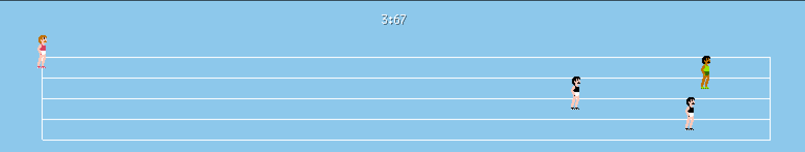
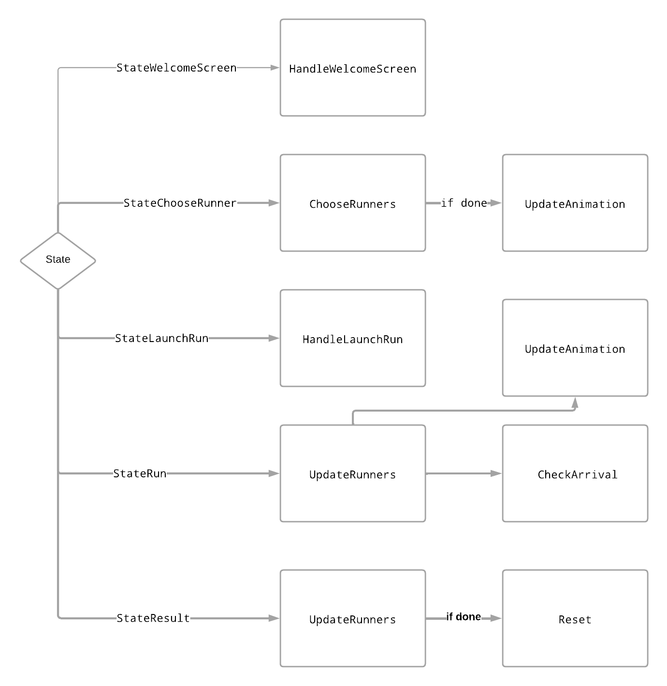
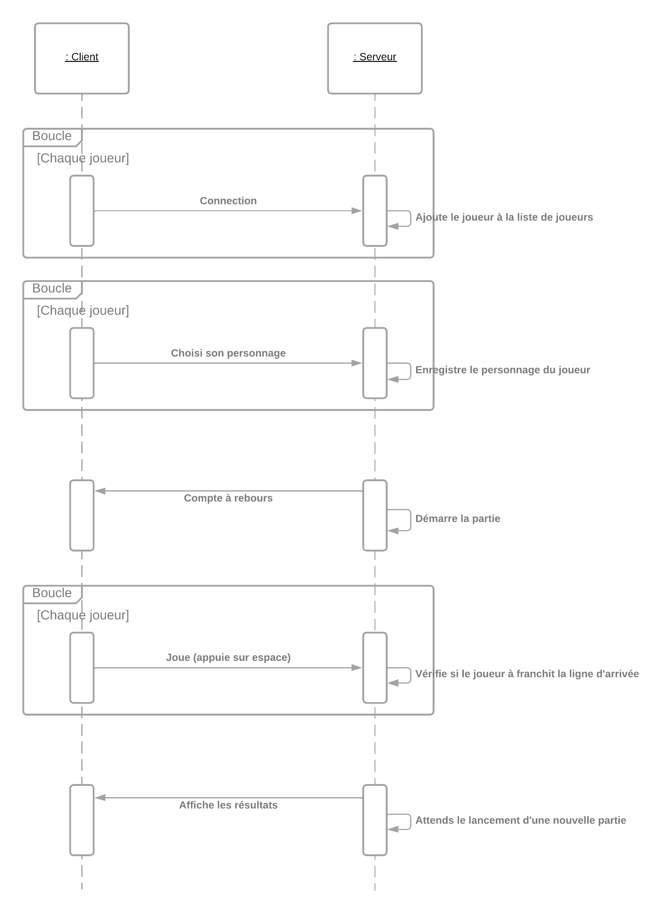

# Projet-programmation-repartie | IUT de Nantes 

Bienvenue dans notre projet de programmation répartie en Go.
L'objectif du projet est de permettre à quatre joueurs de jouer ensemble en réseau à un jeu de course qui était à l'origine destiné à être joué en local.

### Exemple de Vue du jeu : 

## Installation
*Build le projet avec la commande suivante :*

`go build`

*Coté serveur (lancement):*

`TODO`

*Coté client (lancement):*

`TODO`

## Schema du fonctionnement du jeu (boucle update) :

# Guide

## Partie 1.1 - À quoi servent les fonctions ?

#### HandleWelcomeScreen

Page d'acceuil. Attend que le joueur appuie sur espace avant de passer à l'écran suivant (la sélection du personnage).

#### ChooseRunners

Permet à chaque joueur de sélectionner son personnage.

#### HandleLaunchRun

Compte à rebours pour indiquer le début de la partie.

#### UpdateRunners

Met à jour la position de chaque joueur sur la piste de course.

#### CheckArrival

Boucle sur les joueurs un par un pour vérifier s'il est arrivé.

#### Reset

Remet à zéro la partie.

#### UpdateAnimation

Met à jour les images des caractères des joueurs. Permet par exemple de créer une animation lors de la course.

#### HandleResults

Calcule les temps de course de chaque joueurs et affiche les résultat après un appui sur la touche `espace`

## Partie 1.2 - Comment sait-on à quelle étape du jeu on est ?

Pour savoir a qu'elles étapes le jeux est rendu on se réfère au State, le State peux avoir pour valeur :

 - **StateWelcomeScreen** : écran d'acceuil

 - **StateChooseRunner** : écran choix de personnage

 - **StateLaunchRun** : Décompte avant début de course

 - **StateRun** : Course en cours

 - **StateResult** : Fin de course, affichage des résultats

 ## Partie 1.3 - À quoi sert l’argument -tps lorsqu’on lance le jeu ?

 **TPS** : Nombre d'appel à la fonction Update par seconde.

 ## Partie 2 - Fonctionnement du serveur

## Credits
 * **Auger-Dubois Benoit**
 * **Menanteau Melvin**